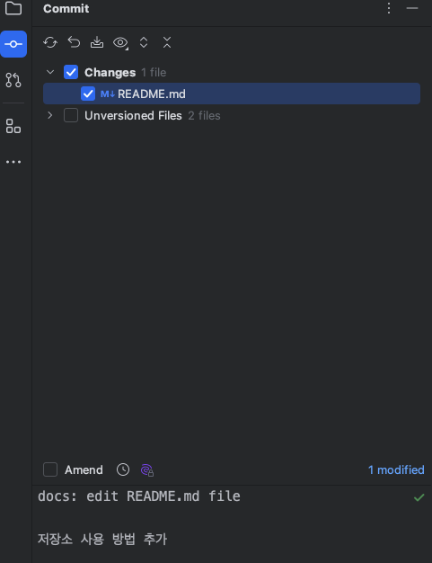
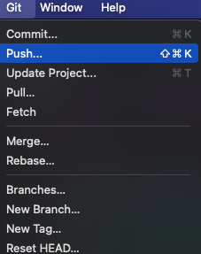
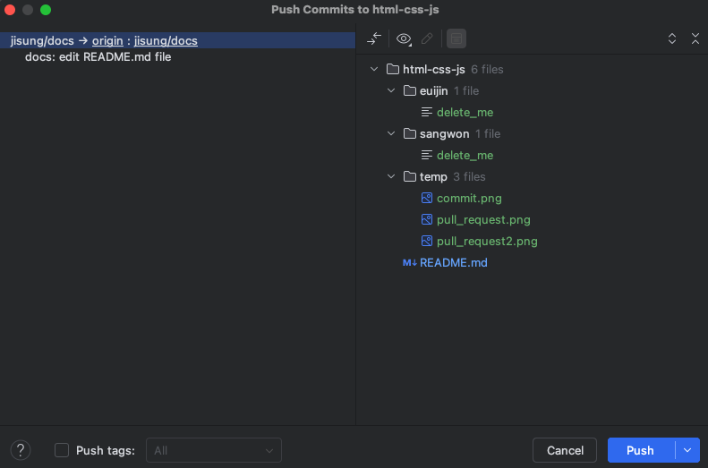
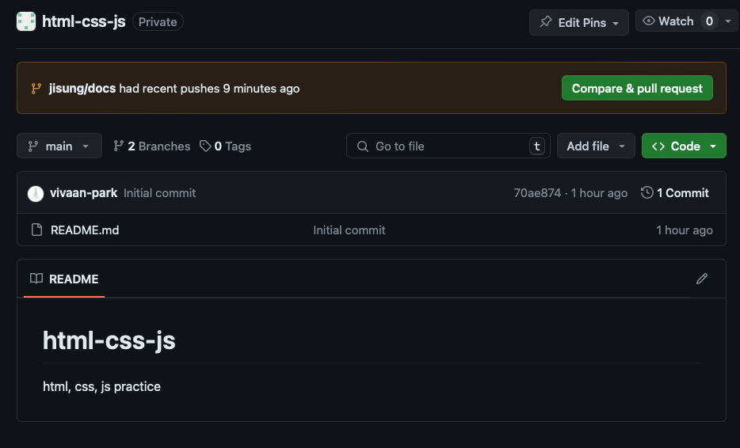
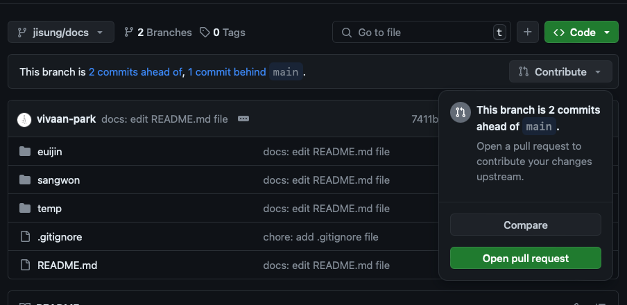
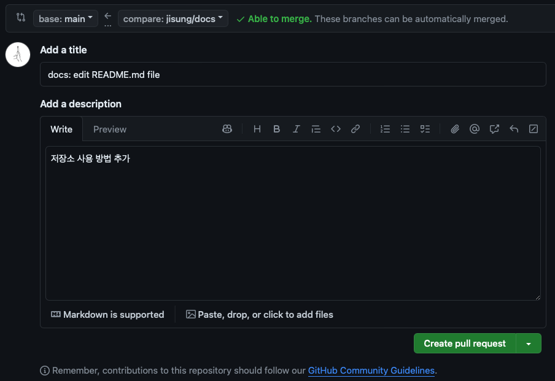

# 복습을 위한 저장소

## 시작하기

1. 아래 명령어를 입력해서 저장소를 클론한다.  
   `git clone https://github.com/junkfood-dev/reviews.git`
2. 각자 자기 `이름/공부내용`의 브랜치를 만들고 생성한 브랜치로 변경한다.  
   `git branch jisung/html` 이후 `git switch jisung/html`  
   또는 `git switch -c jisung/html` (브랜치 생성 후 바로 변경)
3. 자기 이름 폴더의 `delete_me` 파일은 지운다.

---

## 연습하기

1. `이름/공부내용`의 브랜치를 만들고 변경한다.
2. 자기 이름 폴더에 복습 자료를 생성한다.
3. 복습 자료를 작성 후 `commit` 한다.  
   
4. `push` 한다.  
   
   
5. `main` 브랜치로 pull request를 요청한다.
    1. `main` 브랜치에서 `Compare & pull request` 클릭  
       
    2. 또는 새로 `push`한 브랜치에서 `Open pull request` 클릭  
       
    3. `Create pull request` 클릭  
       

6. 나한테 pr 날렸다고 말한다.
7. 내가 확인하고 병합 해줄때까지 기다린다.

---

## 주의사항

1. 작업 전 `main` 브랜치에서 `git pull`을 한다.
    1. 개인적으로 생성한 브랜치는 pr 과정에서 내가 삭제함.
    2. 각자 자기 폴더에 작업하기 때문에 안해도 되지만, 습관을 들이셈
2. `main` 브랜치가 아닌 `이름/공부내용` 브랜치를 새로 만들어서 작업한다.
    1. 브랜치는 `main` 브랜치에서 만들어야 함
3. 만약 브랜치를 생성하는 것을 까먹고, `main`브랜치 혹은 다른 브랜치에 작업했다면, 아래 내용을 따라한다.
    1. 새로운 브랜치 생성 및 전환  
       `git switch -c jisung/html`
4. 만약 3번의 상황에서 `main` 브랜치에 커밋을 해버렸다면 아래를 따라한다.
    1. 새로운 브랜치 생성  
       (만약 터미널이 아닌 인텔리제이 기능으로 브랜치를 생성했을 경우 브랜치가 변경되니 다시 `main` 브랜치로 변경해야함)
       `git branch jisung/html`
    2. `main` 브랜치 초기화  
       `git fetch origin`  
       `git reset --hard origin/main`
    3. 이렇게 하면 위에서 생성한 새로운 브랜치로 커밋 내용이 변경되므로 브랜치를 변경하여 작업 진행