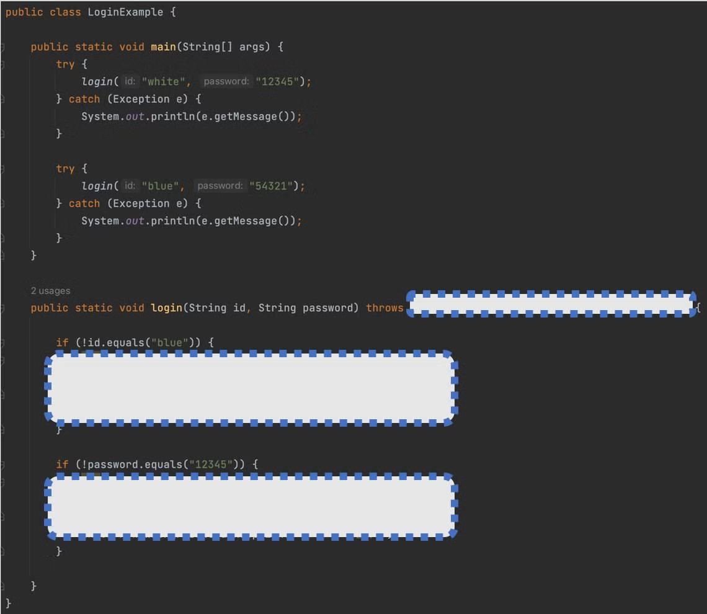
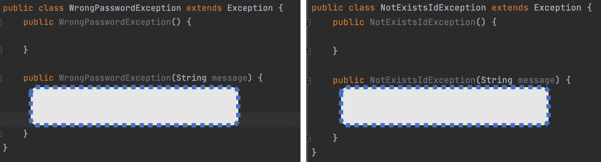

### 1. 예외에 대한 설명 중 틀린것은?

1) 예외는 사용자의 잘못된 조작, 개발자의 잘못된 코딩으로 인한 프로그램 오류를 말한다.
2) RuntimeException의 하위 예외는 컴파일러가 예외 처리 코드를 체크하지 않는다.
3) 예외는 try-catch 블록을 사용해서 처리된다
4) 자바 표준 예외만 프로그램에서 처리할 수 있다
```javascript
4.  사용자 정의 예외가 있음
```

### 2. try-catch-finally 블록에 대한 설명 중 틀린 것은?

1) try { } 블록에는 예외가 발생할 수 있는 코드를 작성한다.
2) catch { } 블록은 try { } 블록에서 발생한 예외를 처리하는 블록이다.
3) try { } 블록에서 return문을 사용하면 finally { } 블록은 실행되지 않는다.
4) catch { } 블록은 예외의 종류별로 여러 개를 작성할 수 있다.
```javascript
3. finally는 신이다
```
### 3. throws에 대한 설명으로 틀린 것은?

1) 생성자나 메소드의 선언 끝 부분에 사용되어 내부에서 발생된 예외를 떠넘긴다.
2) throws 뒤에는 떠넘겨야 할 예외를 쉼표(,)로 구분해서 기술한다.
3) 모든 예외를 떠넘기기 위해 간단하게 throws Exception으로 작성할 수 있다.
4) 새로운 예외를 발생시키기 위해 사용된다.
```javascript
4. 이건 throw이야기
```
### 4. throw에 대한 설명으로 틀린 것은?

1) 예외를 최초로 발생시키는 코드이다.
2) 예외를 호출한 곳으로 떠넘기기 위해 메소드 선언부에 작성된다.
3) throw로 발생된 예외는 일반적으로 생성자나 메소드 선언부에 throws로 떠넘겨진다.
4) throw 키워드 뒤에는 예외 객체 생성 코드가 온다.

```javascript
2. 이건 throws 이야기
```

### 5. 다음과 같은 메소드가 있을 때 예외를 잘못 처리한 것은 무엇입니까?

```java
public void method1() throws NumberFormatException, ClassNotFoundException { ... }
```

1) try { method1(); } catch(Exception e) { }
2) void method2() throws Exception { method1() };
3) try { method1(); } catch(Exception e) { } catch(ClassNotFoundException e) { }
4) try { method1(); } catch(ClassNotFoundException e) { } catch(NumberFormatException e) { }
```javascript
3. 항상 상위 예외 클래스가 아래로 와야함 안그러면 컴파일 에러뜸
```
### 6. 다음 코드가 실행되었을 때 출력 결과는 무엇입니까?

```java
public class TryCatchFinallyExample {

	public static void main(String[] args) {
		String strArray[] = {"10", "23b"};
		int value = 0;
		for (int i = 0; i < 2; i++) {
			try {
				value = Integer.parseInt(strArray[i]);
			} catch (ArrayIndexOutOfBoundsException e) {
				System.out.println("인덱스를 초과하였음");
			} catch (NumberFormatException e) {
				System.out.println("숫자로 변환할 수 없음");
			} finally {
				System.out.println(value);
			}
		}
	}

}
```
```javascript
10  // i = 0 -> try에 걸리는 문제 없음 -> finally에 10
"숫자로 변환할 수 없음" // i = 1 -> Integer.parseInt(strArray[1]에서 NumberFormatException 발생 -> "숫자로 변환 할 수 없음" 출력
10 // i = 1의 finally에 10
```

### 7. 로그인 기능을 Member 클래스의 login() 메소드에서 구현하려고 합니다. 존재하지 않는 ID를 입력했을 경우 `NotExistsIdException`을 발생시키고, 잘못된 패스워드를 입력했을 경우 `WrongPasswordException`을 발생시키려고 합니다. `LoginExample`의 실행 결과를 보고 빈칸을 채워보세요.

<LoginExample 실행결과>

```java
// LoginExample의 실행결과
아이디가 존재하지 않습니다.
패스워드가 틀립니다.
```

LoginExample 빈칸 채우기


```javascript
class를 첨부해서 올림
```

<NotExistsIdException, WrongPasswordException 클래스 빈칸 채우기>
