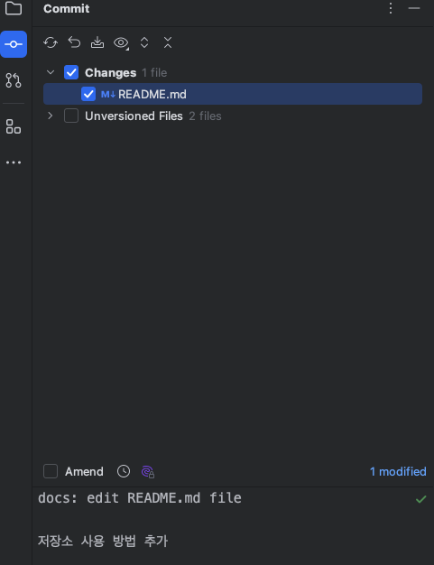
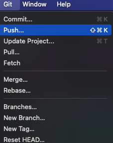
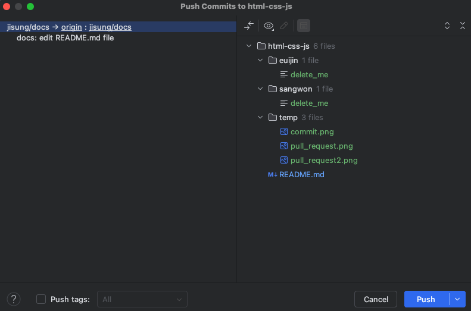
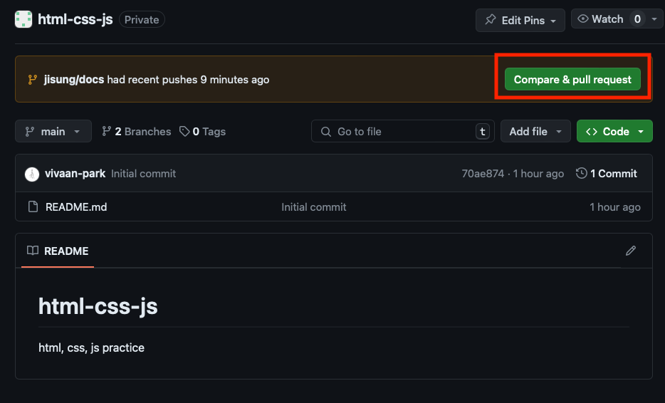
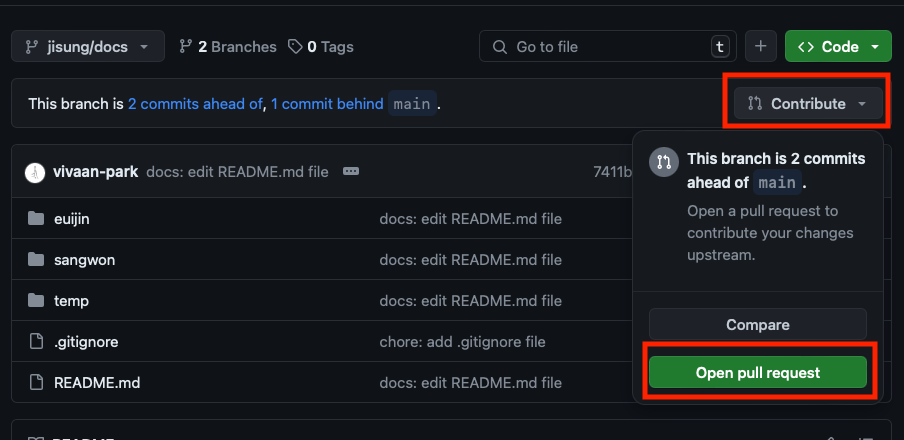
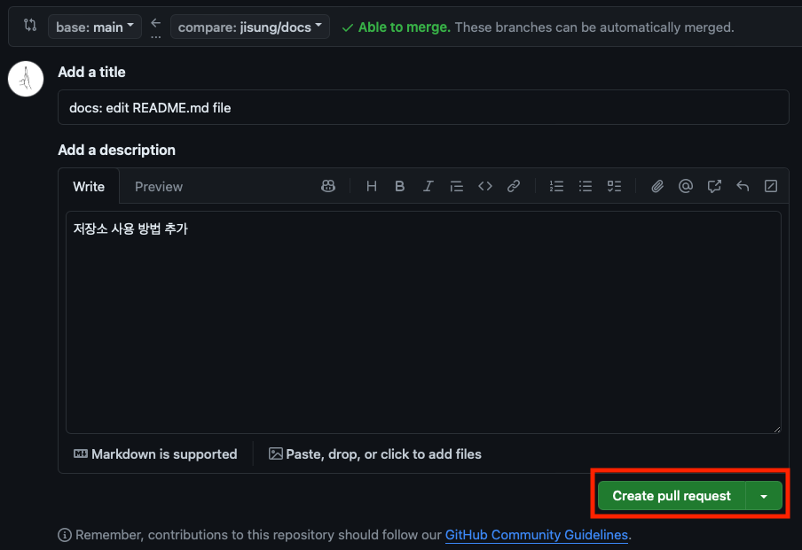

# 시작하기

1. 아래 명령어를 입력해서 저장소를 클론한다.  
   `git clone https://github.com/junkfood-dev/reviews.git`
2. 각자 자기 `이름/공부내용`의 브랜치를 만들고 생성한 브랜치로 변경한다.  
   `git branch jisung/html` 이후 `git switch jisung/html`  
   또는 `git switch -c jisung/html` (브랜치 생성 후 바로 변경)
3. 자기 이름 폴더의 `delete_me` 파일은 지운다.

---

# 연습하기

1. `이름/공부내용`의 브랜치를 만들고 변경한다.
2. 자기 이름 폴더에 복습 자료를 생성한다.
3. 복습 자료를 작성 후 `commit` 한다.  
   
4. `push` 한다.  
   
   
5. `main` 브랜치로 pull request를 요청한다.
    1. `main` 브랜치에서 `Compare & pull request` 클릭  
       
    2. 또는 새로 `push`한 브랜치에서 `Open pull request` 클릭  
       
    3. `Create pull request` 클릭  
       

6. 나한테 pr 날렸다고 말한다.
7. 내가 확인하고 병합 해줄때까지 기다린다.